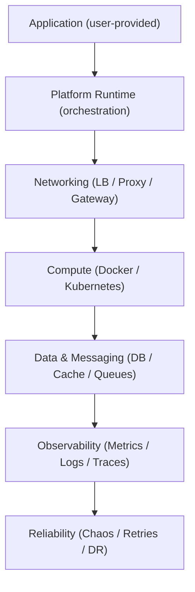

# ForgeLab

**ForgeLab** is a reusable **Production Systems Simulation and Engineering Platform** — a place where real or synthetic applications are plugged in and executed inside a production-like environment.

ForgeLab is not an application. It is a playground for learning, experimentation, benchmarking, incident simulation, distributed-systems practice, SRE, platform engineering, DevOps, cloud infrastructure, and system design.

> **Bring your app → enable the components you need → break it on purpose → learn how production actually behaves.**

---

## Status

**Phase 1 — Local single-node: done.** ForgeLab can now run a minimal
production-like lab on one machine: a reverse proxy, a sample application,
and a PostgreSQL database, all declared in
[`environments/local/`](environments/local/) and started with `make up`.
Earlier phases established the documentation foundation and the Go core
(`forgelab validate` for application manifests).

The currently implemented decisions are recorded in [`docs/decisions/`](docs/decisions/).

---

## Project Overview

ForgeLab lets a user provide their own application (Rails, Phoenix, Django, FastAPI, Spring Boot, Next.js, React, and more) **or generate a synthetic application from configuration alone** — and enable only the production infrastructure components they want around it.

Supported application shapes include:

* Monolith
* Server-rendered application
* SPA + API
* Microservices
* Event-driven architecture
* Background workers
* Distributed systems
* **Synthetic applications** — generated from configuration (future Workload DSL), modeling production operations without business logic

Supported production components (all **optional** and **composable**):

* Docker, Kubernetes
* Load Balancer, Reverse Proxy, API Gateway
* PostgreSQL, Redis, RabbitMQ, Kafka, Object Storage
* Prometheus, Grafana, Loki, Tempo, OpenTelemetry
* Terraform, AWS, GCP
* CI/CD, Security, Chaos Engineering, Load Testing

---

## Vision

```text
Your application                        Infrastructure (just what you need)
+----------------------+                +--------------------------------------+
| Rails / Phoenix /    |                | Networking   Load Balancer, Proxy      |
| Django / FastAPI /   |    plugs       | Compute      Docker, Kubernetes, HPA   |
| Spring / Next.js /   |  ───────────►  | Data         Postgres, Redis, Kafka    |
| React / ...          |    into        | Messaging    RabbitMQ, Queues, DLQs    |
|                      |                | Observability  Prometheus, Grafana    |
+----------------------+                | Reliability  Chaos, Retries, DR       |
                                        +--------------------------------------+
                       ForgeLab Platform Runtime orchestrates it all
```

Every layer is optional. A simple monolith can run with nothing but Docker and a database; a distributed demo can use every component at once. Applications can be real (your code) or synthetic (generated by the Workload Engine from configuration).

---

## Features (planned)

* **Application manifests** — declare an application once, run it in any environment
* **Synthetic applications** — a Workload Engine generates production-like apps from configuration; no business logic needed
* **Workload templates** — reusable behavior profiles (crud-api, read-heavy, checkout, search, …)
* **Component catalog** — a library of composable production components per domain
* **Environment presets** — `local`, `staging`, `cloud` out of the box
* **Scenario library** — reproducible incidents, traffic, security, and failure drills
* **Observability by default** — metrics, logs, and traces for every component
* **Chaos & reliability tooling** — injection, retries, circuit breakers, DR drills
* **Dashboard** — a thin Next.js UI to launch, monitor, and inspect experiments
* **Benchmarks & load testing** — repeatable load profiles against any deployment

---

## Architecture Overview

ForgeLab is layered conceptually as follows. Every layer is optional and composable.



Each layer can be included or skipped per environment. See [`docs/architecture.md`](docs/architecture.md) for details.

**Decided stack:**

| Layer | Choice | Rationale |
|---|---|---|
| Backend / simulation core | **Go** | Strong infrastructure-tooling ecosystem, single static binaries, excellent concurrency |
| Dashboard | **Next.js** (TypeScript) | Thin API consumer; App Router; familiar web stack |
| Analytics / AI | **Python** *(later, optional)* | Separate service, never woven into the Go core |

---

## Repository Structure

```text
ForgeLab/
├── docs/            # Vision, architecture, principles, catalog, scenarios, ADRs
├── applications/    # User-provided sample applications (pluggable)
├── manifests/       # Application manifest schema + examples
├── components/      # Optional production components, grouped by domain
├── environments/    # local / staging / cloud presets
├── scenarios/       # Incident, traffic, and reliability drill definitions
├── scripts/         # Development and validation helpers
├── templates/       # Starting points for apps, services, manifests
└── .github/         # Issue/PR templates and CI workflows
```

See [`docs/repository-structure.md`](docs/repository-structure.md) for the full map and folder-ownership rules.

---

## Design Philosophy

* **Platform over application** — ForgeLab is the stage, not the playwright
* **Composition over configuration** — enable what you need, ignore the rest
* **Production parity** — the lab behaves like a real production environment
* **Behavior over features** — ForgeLab reproduces the engineering characteristics of production systems, not specific products
* **Observable by default** — every component ships with metrics, logs, and traces
* **Failure is a feature** — incidents are here to be studied, not avoided
* **Infrastructure as Code** — everything is declared, versioned, and reproducible
* **Cloud agnostic** — no vendor lock-in; local-first with cloud presets
* **Documentation first** — architecture and decisions precede implementation

See [`docs/principles.md`](docs/principles.md).

---

## Future Roadmap (summary)

1. **Foundation** — bootstrap docs, conventions, manifest schema *(done)*
2. **Simulation Foundation** — Resource Virtualization Engine, physical vs virtual metrics *(planned)*
3. **Local single-node** — Docker Compose runtimes, first components *(done)*
4. **Observability** — metrics/logs/traces wired into every component
5. **Messaging & queues** — RabbitMQ/Kafka, DLQs, async patterns
6. **Kubernetes** — clusters, scaling, rollout strategies
7. **Reliability & chaos** — fault injection, outage drills, DR
8. **Cloud presets** — Terraform + AWS/GCP
9. **CI/CD & dashboard** — pipeline simulation, lab UI
10. **Security drills** — attack simulation, secrets, compliance
11. **Production Simulator** — the full experience, end to end

> **Planning sketch (non-committal):** Synthetic Applications / Workload Engine — Workload DSL, production operations, production infrastructure, resource virtualization, scenarios/reliability, dashboard. See the "Proposed: Synthetic Applications roadmap" section in [`ROADMAP.md`](ROADMAP.md).

Full detail in [`ROADMAP.md`](ROADMAP.md) and [`docs/learning-path.md`](docs/learning-path.md).

---

## Documentation Map

| Document | Purpose |
|---|---|
| [AGENTS.md](AGENTS.md) | Rules governing AI agents and collaborators |
| [CONTRIBUTING.md](CONTRIBUTING.md) | How to contribute to ForgeLab |
| [ROADMAP.md](ROADMAP.md) | Phased implementation plan |
| [CHANGELOG.md](CHANGELOG.md) | Release history |
| [docs/vision.md](docs/vision.md) | Why ForgeLab exists |
| [docs/architecture.md](docs/architecture.md) | Conceptual architecture |
| [docs/principles.md](docs/principles.md) | Design principles |
| [dashboard/README.md](dashboard/README.md) | Dashboard: run, configuration, pages |
| [docs/development-loop.md](docs/development-loop.md) | Requirement → plan → implement → review → test → document loop |
| [docs/repository-structure.md](docs/repository-structure.md) | Directory map and ownership |
| [docs/component-catalog.md](docs/component-catalog.md) | Catalog of planned components |
| [docs/scenarios.md](docs/scenarios.md) | Planned lab scenarios |
| [docs/learning-path.md](docs/learning-path.md) | Progressive learning roadmap |
| [docs/glossary.md](docs/glossary.md) | Terminology reference |
| [docs/decisions/](docs/decisions/) | Architecture Decision Records |

When documents conflict, stop and identify the conflict instead of silently choosing one.

---

## Getting Started

The fastest way to see ForgeLab run is the `local` preset — a production-like
single-node stack (reverse proxy → sample application → PostgreSQL) declared in
[`environments/local/`](environments/local/compose.yaml).

1. Clone the repository.
2. **Recommended:** open the repo in VS Code / Cursor with the Dev Containers extension and reopen in the container (`.devcontainer/`), which provides Go, Node.js, Docker-in-Docker, and the Compose plugin. Developing outside the container works too, but the toolchain versions you need (Go, Node.js, Docker, Make) must be installed manually.
3. Start the lab:

   ```sh
   cp environments/local/.env.example environments/local/.env   # optional
   make up
   ```

4. Open <http://localhost:8080/> — a sample page served through the reverse proxy — or check the full chain with <http://localhost:8080/healthz>.
5. Stop with `make down` (database data persists in the `dbdata` volume).

Read [`docs/vision.md`](docs/vision.md), [`docs/architecture.md`](docs/architecture.md), and [`CONTRIBUTING.md`](CONTRIBUTING.md) before contributing.

---

## License

Apache License 2.0 — see [LICENSE](LICENSE).