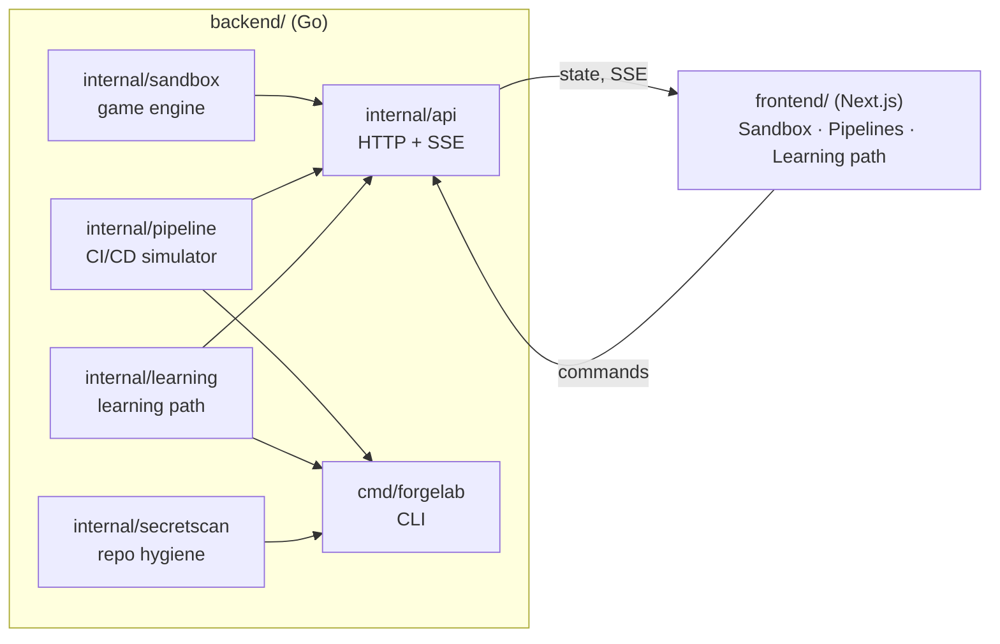
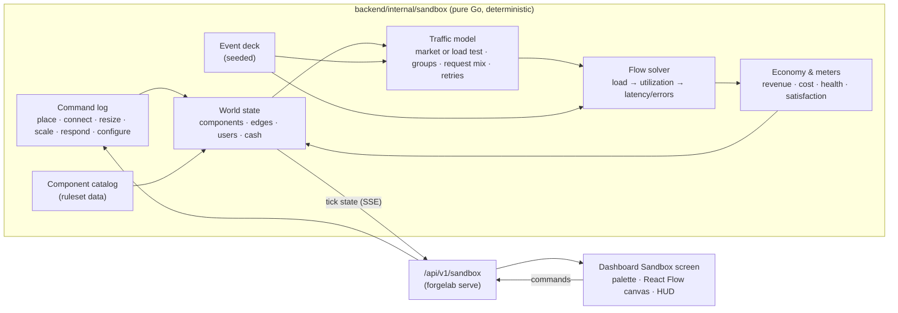

# ForgeLab Architecture

**Document status:** v2.0 (re-scoped by [ADR-0014](decisions/0014-sandbox-only-platform.md))
**Primary decision records:** [ADR-0001](decisions/0001-apply-stack-foundations.md) (stack), [ADR-0013](decisions/0013-production-sandbox-game.md) (Sandbox), [ADR-0014](decisions/0014-sandbox-only-platform.md) (Sandbox only), [ADR-0016](decisions/0016-configurable-internet-traffic.md) (Internet traffic), [ADR-0017](decisions/0017-application-instance-model.md) (application instance), [ADR-0018](decisions/0018-traffic-components.md) (traffic components), [ADR-0019](decisions/0019-connections-and-service-calls.md) (connections and service calls), [ADR-0020](decisions/0020-database-model.md) (database), [ADR-0021](decisions/0021-cache-model.md) (cache), [ADR-0022](decisions/0022-object-storage-model.md) (object storage), [ADR-0023](decisions/0023-queue-and-worker-model.md) (queues and workers), [ADR-0024](decisions/0024-event-streams.md) (event streams), [ADR-0025](decisions/0025-edge-components.md) (edge), [ADR-0027](decisions/0027-configured-telemetry.md) (telemetry), [ADR-0028](decisions/0028-explaining-failures.md) (explaining failures), [ADR-0029](decisions/0029-alerts-slos-incidents.md) (alerts and SLOs)

ForgeLab is the **Production Sandbox**: a city-builder for software production. A new game is an **empty world** and starting cash (from `sandbox/v6`; earlier rulesets also start with an Internet traffic source). The player places components, wires them together, and keeps the system healthy and profitable as users arrive, traffic swings, and incidents happen. Everything is a deterministic model computed in the Go core; nothing runs on the host.

| Part | Where | Role |
|---|---|---|
| Sandbox engine | `backend/internal/sandbox` | World state, ruleset, flow solver, economy, meters, save/replay |
| Sandbox API | `backend/internal/api/sandbox.go` | Games, commands, speed, step, save/replay, SSE stream |
| Sandbox canvas | `frontend/app/sandbox`, `frontend/components/Sandbox*` | Build palette, React Flow canvas, meters, inspector |
| Pipeline simulator | `backend/internal/pipeline`, `manifests/pipelines/` | Build, test, and deploy on a virtual clock (rolling, canary, blue-green, rollback) |
| Learning path | `learning/path.yaml`, `backend/internal/learning` | Missions played in the Sandbox and the pipeline simulator; completed automatically by Sandbox goals or by hand; progress in `.forgelab/progress.json` |
| Secret scan | `backend/internal/secretscan`, `security/secretscan.yaml` | Keeps credentials out of the repository |

## Engine layout

A game is fully defined by **(ruleset version, seed, ordered command log)**. Replaying the same triple yields the same world at every tick, so games are reproducible, testable in CI, and saved as data under `.forgelab/sandbox/`.

## One tick

Simulated time advances in fixed ticks (initially five simulated minutes; tuning lives in the ruleset). Each tick:

1. **Apply commands** queued since the last tick, after validation (cash, allowed connections, limits).
2. **Draw events** from the seeded deck; odds depend on complexity (failures) and popularity (surges, attacks). Each tick draws from its own random stream built from `(seed, tick)`, so a replay deals the same cards. The events active this tick become the tick's *effects* on model inputs (below).
3. **Generate traffic** from each traffic component (from v6, see [Traffic components](#traffic-components)) or the Internet's configuration (v1 to v5, see [Traffic model](#traffic-model)): the volume, split into request classes, amplified by retries, plus attack traffic of `attack magnitude × RPS` during a DDoS.
4. **Solve the flow** through the topology (below).
5. **Update the economy:** revenue for successful requests, cost for every component, operations overhead from complexity.
6. **Update the meters and the userbase:** satisfaction from latency, errors, and availability; growth from popularity; churn from low satisfaction. During a load test the userbase, satisfaction, and popularity hold still, and revenue is zero. From v6, satisfaction and popularity also hold still while no traffic component sends real requests.
7. **Track events:** record each event's lowest health, and judge it one hour after it ends (recovered when health is at least 80). An event still being tracked during a load test is marked and does not count towards goals.
8. **Check goals:** a goal whose conditions held for its required ticks is reached, permanently, and may unlock component kinds. Goals are not checked during a load test, and their hold streaks start over.
9. **Publish** the tick state to subscribers.

## Traffic components

From `sandbox/v6` traffic comes from **traffic components** ([ADR-0018](decisions/0018-traffic-components.md)). A new game has none; the player places them like any component. Each is **one population of clients**, configured with `configure` (`ClientConfig`), and costs nothing.

* **Single choices:** client type (web, mobile, API client, bot), region, protocol (HTTP/1.1, HTTP/2, gRPC), scheme (http, https), port, keep-alive, client timeout, retries, and the source (market, or a load test with a pattern as below). The one list is the weighted **endpoint mix**.
* **Market volume.** `market = active users × engagement × diurnal(t)`. A component takes `market × client-type share × region share ÷ components of the same segment × traffic events on it`. The shares are ruleset data: web 70%, mobile 20%, API 8%, bot 2%; asia 35%, europe 25%, north America 20%, south America 10%, Africa 5%, Oceania 5%. A segment with no component is not captured and earns nothing.
* **Connections.** A traffic component connects to exactly one component, in v6 an application instance. An application may take many. Nothing connects to a traffic component.
* **Adopting on connect.** A new traffic component has no endpoints. Connecting it to an application sets its protocol, port, scheme (https when the app has TLS), and keep-alive to the app's, and its endpoints to one per route except `*`, in equal shares to hundredths of a percent (the first takes the remainder). Reconfiguring the app adopts again for every traffic component connected to it. Disconnecting, or removing the app, returns a component to the default connection settings and no endpoints; its name, client type, region, timeout, retries, and source stay. The player may change any of it while connected.
* **The contract**, checked every tick:

  | Traffic | Application | Mismatch |
  |---|---|---|
  | protocol | `protocol` | every request fails: protocol error |
  | port | `port` | every request fails: connection refused |
  | scheme | `tls` | every request fails: TLS handshake error |
  | endpoint | its route or `*` | that endpoint fails with 404 |
  | keep-alive | `keepAlive` | a connection is kept alive only when both sides do |
  | timeout | `timeoutMs` | the shorter decides success |

  Refused requests never reach the application. A 404 costs the middleware. A request whose client gave up still loads the server and its dependencies.
* **Retries** per component: `load × (1 + f + … + f^N)` attempts, where `f` is that component's attempt failure rate on the previous tick.
* **Each application mixes its inputs.** Its endpoint mix is its inputs' endpoints weighted by their attempts; with no input it is measured at its own routes in equal shares.
* **Aggregated.** Every meter is a total or a request-weighted mean over every traffic component. The flow's `traffic` adds RPS by client type and by component; each traffic node reports its own `traffic`: RPS, retries, successes, failures by reason (refused, not found, rejected, timed out, errors), latency, concurrency, and the contract problem.

## Connections and service calls

From `sandbox/v7` every edge is a connection ([ADR-0019](decisions/0019-connections-and-service-calls.md)).

* **Listeners:** databases SQL :5432, caches RESP :6379, object storage S3 + TLS :443, queues AMQP :5672, applications their own protocol, port, and TLS. `configure` with `listener` changes a component's.
* **Connections:** each edge to a listener has a client side (protocol, port, TLS, pool per caller replica, timeout, retries), adopted on connect (pool 20, timeout 1 s, no retries) and following the target's listener. A mismatch refuses every call over it, with the reason on the edge.
* **Service calls:** a route's `calls` name a service (an application's name) and an endpoint, sync or async. They reach the connected instances of that name. Load is carried **per endpoint** to every application, so a service receives exactly what its callers call.
* **A call's outcome:** latency `t + 0.5 ms` hop; success `p × (1 − exp(−timeout ÷ latency))`; with `r` retries `1 − (1 − p)^(r+1)`, sending `1 + f + … + f^r` attempts (`f` from the previous tick). An async call costs the caller only the hop and never fails it.
* **Pools:** a call holds a connection for its latency, so each connection limits its caller to `pool × replicas ÷ connection seconds per request` (bottleneck `pool:<target>`).
* **Reported:** `flow.edges` gives, per connection, attempts, retries, failures, latency, and the contract problem.

## Database model

From `sandbox/v8` a database primary or read replica is a modelled data store ([ADR-0020](decisions/0020-database-model.md)), configured with `db` and sized like an application, plus IOPS (small 1,000, medium 3,000, large 8,000).

* **Data** `= 200 MB + 50 KB × users`, working set 20%; **hit ratio** `= min(1, 75% of memory ÷ working set)`.
* **A query:** pages (plus one per MB of data when unindexed); CPU `cpu + 0.005 ms × pages`; disk reads `pages × (1 − hit)`, and a write logs once and writes its pages; service `CPU + disk × 0.5 ms`.
* **Capacity:** the smallest of CPU (`vCPU × 1000 ÷ CPU per query`), IOPS (`IOPS ÷ disk per query`), and on a primary locks (`hot rows × 1000 ÷ lock ms` writes/s), at the tick's mix. Latency adds the queue wait and, for writes, the lock wait.
* **Connections:** the callers' pools from every replica; above max connections that share is refused.
* **Replicas** apply their primaries' writes (half a write's CPU, its disk writes) before reads; what they cannot apply accumulates as lag.
* **Reported:** `db` with health, bottleneck, CPU, IOPS, hit ratio, data, connections, refused, reads and writes with latency, waits, and a replica's applied writes and lag.

## Cache model

From `sandbox/v9` a cache is a modelled store ([ADR-0021](decisions/0021-cache-model.md)), configured with `cache` (engine, eviction, TTL, value size, max connections).

* **Memory** is 90% of the size's; the keyspace is the database working set ÷ value size, and requests concentrate on the hottest 5% of keys.
* **Hit ratio** `= min(fits^skew × fresh, warmth)`: `fits = min(1, memory ÷ working set)`; `skew` LRU 0.5, LFU 0.4, none 1; `fresh = 1 − exp(−TTL × reads/s ÷ hot keys)`; `warmth` starts at 0 for a new or restarted cache and rises as misses load keys.
* **Capacity:** CPU (0.02 ms per operation) or network (value size per operation); latency 0.2 ms over the utilization factor. Callers' pools above max connections are refused.
* Misses read through to the database; a full cache evicts a key per miss.

## Object storage model

From `sandbox/v10` object storage is a managed service ([ADR-0022](decisions/0022-object-storage-model.md)), configured with `storage` (class, prefixes, object size), with no size or replicas.

* **Rate:** 5,500 GETs/s per prefix; the rest is throttled and fails.
* **Latency:** first byte by class (standard 20 ms, infrequent 30 ms, archive 2,000 ms) + `object size ÷ 80 Mbps`, over the utilization factor.
* **Cost per hour:** stored GB (`1 GB + 2 MB × users`) at the class's GB-month price ÷ 730, GETs at its price per 1,000, retrieval per GB for colder classes, and egress at $0.09 per GB.

## Queue and worker model

From `sandbox/v11` ([ADR-0023](decisions/0023-queue-and-worker-model.md)):

* **Queues** (`queue`: engine, max backlog, visibility timeout, max deliveries) deliver at least once. With `f` the workers' failure share on the previous tick and `D` max deliveries, each message takes `1 + f + … + f^(D−1)` deliveries, and `f^D` are dead-lettered into the queue's dead-letter count. Publishers succeed when the queue accepts; a full backlog rejects. Delay is `backlog ÷ delivery rate`.
* **Workers** (`worker`: concurrency and a handler route) run the application model with one route `POST /messages`: slots = concurrency, one process per vCPU, timeout = the queue's visibility timeout. A message processed past it, or failed by the handler or a dependency, counts as a failed delivery.

## Event stream model

From `sandbox/v12` an **event stream** (one topic of a Kafka-like log, [ADR-0024](decisions/0024-event-streams.md)) is a component configured with `stream` (partitions, retention, event size, key skew).

* Routes and handlers **publish** with the `stream` dependency.
* **Throughput** `= min(10 MB/s ÷ event size ÷ max(1 ÷ partitions, skew), replicas × network ÷ event size)`; the rest is throttled.
* Every connected worker or application is a **consumer group** that reads **every** event; members beyond the partitions sit idle. Applications receive `POST /events`.
* What a group cannot read accumulates as **lag**; beyond the retention it is **lost**.

## Edge model

From `sandbox/v13` the load balancer, API gateway, and CDN are back with contracts ([ADR-0025](decisions/0025-edge-components.md)). They listen on HTTP/1.1 :443 with TLS, forward load **per endpoint**, and each endpoint's outcome is computed back through every hop.

* **Load balancer** (`lb`): round robin (an equal share per replica) or least connections (by capacity); with health checks a failed target gets nothing, without them it keeps a share and fails it.
* **API gateway** (`gateway`): longest path prefix → service name; no match is a 404; auth adds 2 ms; above the rate limit it answers 429.
* **CDN** (`cdn`): a cacheable endpoint's hit ratio is `1 − exp(−TTL × rate ÷ objects)`; hits take 10 ms, misses go to the origin; priced at $0.02 per GB and $0.0075 per 10,000 requests, with no size or replicas.
* Traffic in front of the edge adopts the edge's listener and the routes of the first application behind it.

## Telemetry model

From `sandbox/v14` seeing the system is configured and paid for ([ADR-0027](decisions/0027-configured-telemetry.md)).

* **Backends:** metrics store (20,000 samples/s small), log store (3,000 lines/s), trace backend (5,000 spans/s), priced per replica-hour and per GB ingested; instrumented components ship to them, split by capacity, and what they cannot take is dropped.
* **Instrumentation** per component (`telemetry`), off by default: metrics (`series × replicas ÷ resolution`), log level and sampling (error: failures; warn: + 5% of the rest; info: 1 per request; debug: 6), trace sampling (`sampled requests × (1 + outgoing connections)` spans). Lines and spans cost applications and workers 0.02 and 0.05 CPU-ms each.
* **Seen:** business meters always; a component's numbers while its metrics reach a store (`obs`); the system's RPS, p95, errors, and health while a component traffic reaches first is monitored (`meters.monitored`). Rulesets before v14 show everything.

## Explaining failures

From `sandbox/v14` every tick has a **report** ([ADR-0028](decisions/0028-explaining-failures.md)), derived after the solve and outside the replayed state:

* **Causes:** failures per second by reason and place (rejected, timed out, handler error, not found, missing dependency, dependency failed, down, too many connections, overloaded, throttled, rate limited, queue full, a broken contract, not connected, third-party outage; dead letters and lost events apart). Seen where the place logs errors to a log store.
* **Metrics history:** a sample per tick for each monitored component.
* **Traces:** per traffic component and endpoint, spans through every hop at the model's mean latencies, nesting service calls; seen when the front component samples traces into a trace backend.
* **Logs:** aggregated lines at each component's level (errors from causes, slow-route warnings, info per route, debug per connection), kept by a log store.

## Alerts, SLOs, and incidents

From `sandbox/v14` the `monitor` command sets the game's alert rules and SLOs ([ADR-0029](decisions/0029-alerts-slos-incidents.md)).

* **Alert rules:** a component or the system, a metric, `>` or `<` a threshold, held for N ticks; each tick a rule is *no data* (not observed), *ok*, *pending*, or *firing*; firing and resolving are logged.
* **SLOs:** availability target over a window of observed ticks: availability `1 − failed ÷ requests`, budget left `1 − failed ÷ ((1 − target) × requests)`, burn rate from the last hour.
* **Timeline:** events, alerts, and the player's commands in tick order.

## Traffic model

Up to `sandbox/v5` the Internet is one node on the canvas. Its configuration (`TrafficConfig`, set with the `configure` command, [ADR-0016](decisions/0016-configurable-internet-traffic.md)) describes who sends traffic, what they request, and from where. Rulesets v1 to v3 have no configuration and use their fixed shares (80% reads, 10% storage).

* **Volume.** The source decides it:
  * `market`: `RPS = active users × engagement × diurnal(t) × traffic events`.
  * `configured` (a **load test**): `RPS = pattern(m) × traffic events`, where `m` is simulated minutes since the configuration was applied:

    | Shape | `pattern(m)` |
    |---|---|
    | constant | `rps` |
    | ramp | `rps + (peak − rps) × min(m / minutes, 1)`; a peak below `rps` ramps down |
    | spike | `peak` while `start ≤ m < start + minutes`, else `rps` |
    | burst | `peak` while `m mod period < minutes`, else `rps` |
    | periodic | `rps + (peak − rps) × (1 − cos(2πm / period)) / 2` |
    | schedule | the rate of the last step at or before the clock's hour; before the first step, the last step of the day holds |

  A load test earns nothing and pauses the market (see [One tick](#one-tick)).
* **Groups.** Each traffic group takes `share × RPS`. Shares sum to 100%.
* **Endpoints and classes.** Each group splits its requests over endpoints. An endpoint's method and flags put it in a **request class**:
  * `GET` is a read, cacheable or not
  * any other method is a write
  * a storage endpoint also fetches an object

  The solver carries each class separately.
* **Retries.** A group with `N` retries sends `load × (1 + f + … + f^N)` attempts per class, where `f` is that class's attempt failure rate on the previous tick. A request fails only when all `N + 1` attempts fail, so its success is `1 − (1 − p)^(N+1)` for an attempt success `p`. Retries therefore rescue transient failures (a third-party outage) and multiply the load of failures that never clear.
* **Regions.** Each group splits over abstract regions (ruleset data). Regions are reported in the breakdown and do not yet change the model.
* **Reported.** Each tick's flow carries `traffic`:
  * source
  * real RPS and retry RPS
  * requests in flight: `attempts × mean latency` (Little's law)
  * RPS by group, region, and endpoint

## Application instance model

From `sandbox/v5` an application instance is a modelled backend web/API service ([ADR-0017](decisions/0017-application-instance-model.md)). Its configuration (`AppConfig`, set with `configure`) applies to each replica. The CPU, memory, and network come from its size: small 1 vCPU / 1 GB / 100 Mbps, medium 2 / 4 / 250, large 4 / 8 / 500. Rulesets v1 to v4 keep the flat capacity described below.

* **Placing.** `place` may carry the instance's configuration, validated before anything is paid, so an instance can start from a **template**. From v6 a template is two choices, both ruleset data the engine never reads:
  * an **application type** sets the routes: e-commerce (the default), flight booking, ride sharing, social feed, video streaming. Each is route names with their costs, dependencies, and a typical share of a client's requests; the economy stays generic (Principle 7).
  * a **stack** sets how they are served: Django, FastAPI, Express, Rails, Go (server, processing, workers, concurrency, middleware, port).

  A route's typical `share` is what a traffic component adopts on connecting (equal shares when none is set).
* **Routes.** The instance splits each request class back into endpoints, in the Internet's shares, and gives each endpoint its route (or the `*` route).
  * A route's own time is `base + middleware ms`, and its CPU is `cpu + middleware CPU + TLS handshake CPU per new connection`.
  * A connection carries one request, or 10 with keep-alive, and a kept-alive connection then idles for 5 s.
  * Its wall time adds its dependencies' latency from the previous tick.
* **Capacity** is the smallest of these, each `capacity ÷ (use per request at this tick's mix)`. The smallest is reported as the bottleneck.

  | Limit | Capacity per replica | Use per request |
  |---|---|---|
  | CPU | `min(workers, vCPU) × 1000` CPU-ms/s | CPU-ms |
  | Slots | workers (sync) or max concurrency (async) | wall time in seconds (Little's law) |
  | Connections | max connections | wall time + keep-alive idle |
  | Network in / out | size Mbps | request / response size in Mb |

  A tick in which the instance starts loses 30 s of capacity.
* **Queue.**
  * The rate-limit middleware first rejects load above its limit.
  * Below capacity, `wait = mean wall time × ρ / (1 − ρ)`, and the queue (`load × wait`) is capped at the backlog.
  * At or above capacity, the instance serves its capacity, the backlog is full, `wait = backlog ÷ capacity`, and the rest is rejected.
* **Outcomes per route.**
  * rejected: as above
  * timed out: `served × exp(−(timeout − own − dependency latency) ÷ wait)`, or all served if the work alone exceeds the timeout
  * failed: the handler's error rate, and any dependency call that fails or has no target
  * The rest succeed with latency `own + wait + dependency latency`.

  Dependency calls are made for every served request, including those whose client timed out.
* **Dependencies.** `cache` (falls back to the database), `db-read`, `db-write` (through a connected queue, else the primary), `queue`, `storage`.
* **Memory** is `workers × 150 MB + (in flight + queued) × route memory`. Beyond the size's memory the instance is out of memory: it is down for `RestartTicks`, then starts again.
* **Health** is derived each tick: stopped, unhealthy (out of memory or > 20% failing), starting, degraded (ρ > 0.85 or > 1% failing), healthy.
* **Reported** in the node's flow as `app`: health, bottleneck, capacity, CPU, memory, in flight, queued, connections, wait, outcome rates, and per-route RPS, outcomes, and latency.

## Flow solver (initial model)

The solver walks the topology from the traffic sources: the Internet node up to v5, every traffic component from v6. The formulas are deliberately simple and documented, so a learner can check them:

* **Routing** — load is carried per request class (cacheable read, read, write), with the part of each class that needs object storage. A node splits outgoing load across its downstream edges in proportion to downstream capacity, so a failed node (capacity 0) receives nothing while a healthy peer exists.
  * **Application instance:** sends reads to a cache if connected, otherwise to database primaries and replicas. It sends writes to a queue if connected, otherwise to primaries. Storage requests also go to object storage. Missing a required target fails that share of requests. The read, write, and storage shares come from the endpoint mix: in v4's default mix about 80% of requests are reads and 12.5% need storage, while v1 to v3 use fixed shares of 80% and 10%.
  * **CDN:** in v4, answers 45% of cacheable reads at the edge, about 30% of the default mix; in v1 to v3, it answers 30% of all requests.
  * **Cache:** serves `hit ratio × reads` and sends misses to the database.
  * **Queue:** accepts writes up to its capacity and backlog limit, and hands them to workers as they have capacity. The backlog carries over between ticks.
* **Utilization** — for a node with capacity `μ` (per replica) and `c` replicas receiving `λ`: `ρ = λ / (c·μ)`.
* **Latency** — `service time / (1 − ρ)` for `ρ < 1` (an M/M/1-style approximation per replica), capped at the timeout. End-to-end latency is the success-weighted mean along the request paths; p95 is approximated as `mean × ln 20 ≈ 3 × mean` (an exponential latency distribution), capped at the timeout. Asynchronous work behind a queue does not add to request latency.
* **Saturation** — when `ρ ≥ 1`, the excess `λ − c·μ` is dropped or queued (queues accumulate backlog up to their limit, then drop). Dropped and timed-out requests are errors.
* **Success** — an attempt succeeds only if every node on its path serves it. Success and latency are solved per class and combined at the Internet, weighted by each class's attempts. With retries, a request succeeds if any of its attempts does.

* **Events** change inputs, never outputs. They can:
  * take replicas down: capacity becomes `up replicas × per-replica capacity`, and a component with no replica up is *down*
  * multiply service time and divide capacity (database slowdown)
  * override a cache's hit ratio
  * multiply capacity (workers) or a kind's running cost
  * fail a fixed share of requests whatever the design (third-party outage)

  Replicas that are down still cost money. A down queue keeps its backlog but neither accepts nor delivers messages.
* **Traffic events** multiply the whole volume up to v5. From v6 traffic cards and the DDoS pick one or more traffic components and act only on them, and component cards never hit a traffic component.
* **Attack traffic** is tracked alongside real traffic through every node. It takes capacity like real traffic, so it crowds out users, but success, errors, and revenue count real requests only. A rate-limited API gateway blocks 90% of the attack traffic it serves and 1% of real requests (false positives).

Bottlenecks are therefore a property of the player's design, not a script (Principle 2).

## Events and responses

The Event Deck is ruleset data: eleven cards, each with odds per day, a driver (popularity or complexity), a duration range, a magnitude range, target kinds, and an optional announcement lead time. The cards and their teaching goals are documented in [`scenarios.md`](scenarios.md). The player answers with `respond` commands:

* `restart`: an instance crash ends in ten minutes
* `failover`: promotes a read replica to primary
* `rate-limit` / `lift-rate-limit`: toggles rate limiting on an API gateway

Build changes are always available as well. Responses are validated and logged like every command.

## Meters

| Meter | Driven by |
|---|---|
| RPS, userbase (total / active) | Traffic model, growth, churn |
| p95 latency, error rate, availability | Flow solver |
| System health (0–100) | Error rate, latency against the SLO, availability |
| Satisfaction (0–100) | Latency, errors, outages over a rolling window |
| Popularity | Satisfaction and events; drives new-user acquisition |
| Engagement | Requests per active user; rises with satisfaction |
| Complexity | Component weights and connections; raises incident odds and operations cost |
| Scale | Tier from userbase and peak RPS |
| Revenue, cost, cash | Successful requests × rate; component and operations cost |

The economy is generic: revenue per successful request, cost per component-hour. No business domain enters the model (Principle 7). A game is lost when cash stays negative past a grace period.

## Rulesets

| Version | What it is |
|---|---|
| `sandbox/v1` | The first ruleset: component kinds, sizes, economy, and growth. It has no events, and stays unchanged so v1 saves replay exactly. |
| `sandbox/v2` | v1 plus the Event Deck and incident responses, with a rebalanced economy. |
| `sandbox/v3` | v2 plus goals and unlocks. |
| `sandbox/v4` | v3 plus a configurable Internet: traffic groups, endpoints, regions, retries, and load tests. The CDN's hit ratio becomes 45% of cacheable reads. |
| `sandbox/v5` | v4 plus the application instance model: capacity from CPU, slots, connections, and network under the routes' costs; middleware; queueing, timeouts, rejection, out-of-memory crashes, and health. |
| `sandbox/v14` | v13 plus configured telemetry: metrics, log, and trace backends with capacity and cost, per-component instrumentation off by default, reporting overhead, dropped telemetry, and a dashboard that shows only what is observed. |
| `sandbox/v13` | v12 plus the load balancer (algorithms, health checks), API gateway (path routing, auth, 429s), and CDN (TTL hit ratio, usage pricing) with contracts and per-endpoint forwarding. |
| `sandbox/v12` | v11 plus event streams: partitions, key skew, brokers, consumer groups with fan-out, lag, retention and loss; the `stream` dependency. |
| `sandbox/v11` | v10 plus at-least-once queues (redelivery, visibility timeout, dead letters, delay) and workers running the application model with a handler. |
| `sandbox/v10` | v9 plus object storage as a managed service: prefixes and throttling, first byte and transfer, usage pricing with egress. |
| `sandbox/v9` | v8 plus the cache model: memory against the working set, eviction policy, TTL against traffic, warm-up after a start, CPU and network limits, max connections. |
| `sandbox/v8` | v7 plus the database model: query profiles, buffer cache over growing data, IOPS, locks, max connections against pools, replication lag. |
| `sandbox/v7` | v6 plus connections on every edge (listeners, client sides with pools, timeouts, and retries, the contract), calls between services sync or async, per-endpoint load, pool bottlenecks, and per-connection stats; microservice templates. |
| `sandbox/v6` | v5 with traffic components instead of the Internet: an empty start, one population per component, the traffic-to-application contract, per-application endpoint mixes, and targeted traffic events. The CDN, load balancer, and API gateway wait for their own contracts; *Scale out* becomes two or more app replicas serving. New games use it; an older version can be chosen when a game is created, and the dashboard opens it with its own ruleset. |

**v2 rebalancing.** Under v1, one application instance costing $2/h earned about $90/h at capacity. Over-provisioning therefore always paid, and incidents never threatened solvency.

v2 cuts revenue per successful request from $0.0005 to $0.00015. At that rate, the balance test in `backend/internal/sandbox/balance_test.go` shows the intended shape. It plays a simple design for a simulated week over ten seeds, re-provisioning every hour:
* a design with about 1.5× headroom earns the most and stays solvent
* no headroom loses money at peaks
* 5× over-provisioning gives up at least 30% of the profit
* unanswered events cost money

Starting cash rises from $1,000 to $1,500 to cover the thinner early margin.

## Goals and unlocks

Goals (missions) are ruleset data checked by the engine after every tick. A goal is reached when all of its conditions hold for its required number of ticks, after the goal it requires. There are three kinds of condition:
* a meter within bounds, or its change over a window (for example, cash now against one day ago)
* a statistic over every component of a kind: total served, highest utilization, total replicas, or backlog
* the number of events judged recovered, optionally only those that pushed health below a level

Reaching a goal is permanent and deterministic, so a replay reaches the same goals at the same ticks.

**Unlocks.** A kind can be locked until a goal is reached, and `place` refuses it until then. A game created with `freeBuild` (kept in its save) has every kind unlocked from the start; goals are still tracked. In `sandbox/v3` a game starts with application instances, database primaries, and object storage:
* the first successful request unlocks the load balancer
* 10,000 users (the startup tier) unlock the cache, read replica, message queue, background worker, and API gateway
* 100,000 users with health of 80 or more unlock the CDN

**The learning path.** Exercises in `learning/path.yaml` can name a goal as their evidence. When a game reaches a goal, the API completes those exercises in the learner's progress file. Data only flows from the game to progress, never back, so a game stays a function of `(ruleset, seed, command log)`. The mapping of goals to exercises is in [`learning-path.md`](learning-path.md).

## Boundaries

* The engine is **headless**; the CLI, tests, or a future analytics service can drive it without the dashboard.
* The dashboard **renders state and sends commands**. It never computes a simulated value (Principle 8).
* Nothing in ForgeLab starts a container, process, or cloud resource; every component is a model.

## Pipeline simulator

`backend/internal/pipeline` plays out a declared pipeline (`manifests/pipelines/*.yaml`) on a virtual clock: build and test steps with durations, cache hits, flaky retries, and a deploy stage using a rolling, canary, or blue-green strategy, with rollback on a bad release. The same pipeline, seed, and options always produce the same run. It is served at `/api/v1/pipelines` and shown on the dashboard's Pipelines page.

## Rules

1. **Nothing is implied.** A new game has no components; the player adds every one.
2. **The dashboard is a consumer.** It renders what the API returns and sends commands; it never reimplements simulation logic.
3. **Everything is simulated and labelled.** No value is presented as a measurement of real hardware or a real service.
4. **Documentation precedes implementation.** A feature is built only when its roadmap phase authorizes it.
