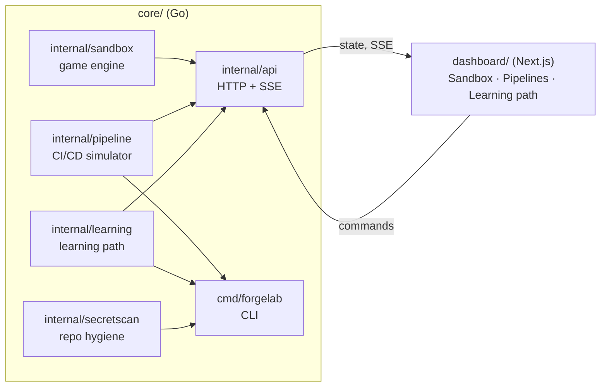
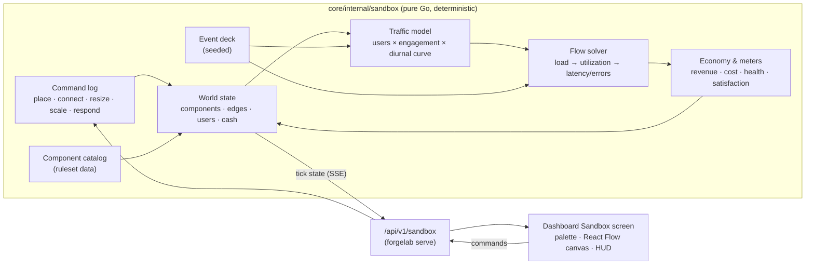

# ForgeLab Architecture

**Document status:** v2.0 (re-scoped by [ADR-0014](decisions/0014-sandbox-only-platform.md))
**Primary decision records:** [ADR-0001](decisions/0001-apply-stack-foundations.md) (stack), [ADR-0013](decisions/0013-production-sandbox-game.md) (Sandbox), [ADR-0014](decisions/0014-sandbox-only-platform.md) (Sandbox only)

ForgeLab is the **Production Sandbox**: a city-builder for software production. A new game is an **empty world**, an Internet traffic source and starting cash. The player places components, wires them together, and keeps the system healthy and profitable as users arrive, traffic swings, and incidents happen. Everything is a deterministic model computed in the Go core; nothing runs on the host.

| Part | Where | Role |
|---|---|---|
| Sandbox engine | `core/internal/sandbox` | World state, ruleset, flow solver, economy, meters, save/replay |
| Sandbox API | `core/internal/api/sandbox.go` | Games, commands, speed, step, save/replay, SSE stream |
| Sandbox canvas | `dashboard/app/sandbox`, `dashboard/components/Sandbox*` | Build palette, React Flow canvas, meters, inspector |
| Pipeline simulator | `core/internal/pipeline`, `manifests/pipelines/` | Build, test, and deploy on a virtual clock (rolling, canary, blue-green, rollback) |
| Learning path | `learning/path.yaml`, `core/internal/learning` | Missions played in the Sandbox and the pipeline simulator; progress in `.forgelab/progress.json` |
| Secret scan | `core/internal/secretscan`, `security/secretscan.yaml` | Keeps credentials out of the repository |

## Engine layout

A game is fully defined by **(ruleset version, seed, ordered command log)**. Replaying the same triple yields the same world at every tick, so games are reproducible, testable in CI, and saved as data under `.forgelab/sandbox/`.

## One tick

Simulated time advances in fixed ticks (initially five simulated minutes; tuning lives in the ruleset). Each tick:

1. **Apply commands** queued since the last tick, after validation (cash, allowed connections, limits).
2. **Draw events** from the seeded deck; odds depend on complexity (failures) and popularity (surges, attacks).
3. **Generate traffic:** `RPS = active users × engagement × diurnal(t) × event modifiers`.
4. **Solve the flow** through the topology (below).
5. **Update the economy:** revenue for successful requests, cost for every component, operations overhead from complexity.
6. **Update the meters and the userbase:** satisfaction from latency, errors, and availability; growth from popularity; churn from low satisfaction.
7. **Publish** the tick state to subscribers.

## Flow solver (initial model)

The solver walks the topology from the Internet node. The formulas are deliberately simple and documented, so a learner can check them:

* **Routing** — a node splits outgoing load across its downstream edges in proportion to downstream capacity, so a failed node (capacity 0) receives nothing while a healthy peer exists. An application instance sends reads (80%) to a cache if connected, otherwise to database primaries and replicas; writes (20%) to a queue if connected, otherwise to primaries; and a further 10% of requests also need object storage. Missing a required target fails that share of requests. A CDN serves 30% of requests at the edge; a cache serves `hit ratio × reads` (80%) and sends misses to the database. A queue accepts writes up to its capacity and backlog limit and hands them to workers as they have capacity; the backlog carries over between ticks.
* **Utilization** — for a node with capacity `μ` (per replica) and `c` replicas receiving `λ`: `ρ = λ / (c·μ)`.
* **Latency** — `service time / (1 − ρ)` for `ρ < 1` (an M/M/1-style approximation per replica), capped at the timeout. End-to-end latency is the success-weighted mean along the request paths; p95 is approximated as `mean × ln 20 ≈ 3 × mean` (an exponential latency distribution), capped at the timeout. Asynchronous work behind a queue does not add to request latency.
* **Saturation** — when `ρ ≥ 1`, the excess `λ − c·μ` is dropped or queued (queues accumulate backlog up to their limit, then drop). Dropped and timed-out requests are errors.
* **Success** — a request succeeds only if every node on its path serves it; availability and error rate follow from that.

Bottlenecks are therefore a property of the player's design, not a script (Principle 2).

## Meters

| Meter | Driven by |
|---|---|
| RPS, userbase (total / active) | Traffic model, growth, churn |
| p95 latency, error rate, availability | Flow solver |
| System health (0–100) | Error rate, latency against the SLO, availability |
| Satisfaction (0–100) | Latency, errors, outages over a rolling window |
| Popularity | Satisfaction and events; drives new-user acquisition |
| Engagement | Requests per active user; rises with satisfaction |
| Complexity | Component weights and connections; raises incident odds and operations cost |
| Scale | Tier from userbase and peak RPS |
| Revenue, cost, cash | Successful requests × rate; component and operations cost |

The economy is generic: revenue per successful request, cost per component-hour. No business domain enters the model (Principle 7). A game is lost when cash stays negative past a grace period.

## Boundaries

* The engine is **headless**; the CLI, tests, or a future analytics service can drive it without the dashboard.
* The dashboard **renders state and sends commands**. It never computes a simulated value (Principle 8).
* Nothing in ForgeLab starts a container, process, or cloud resource; every component is a model.

## Pipeline simulator

`core/internal/pipeline` plays out a declared pipeline (`manifests/pipelines/*.yaml`) on a virtual clock: build and test steps with durations, cache hits, flaky retries, and a deploy stage using a rolling, canary, or blue-green strategy, with rollback on a bad release. The same pipeline, seed, and options always produce the same run. It is served at `/api/v1/pipelines` and shown on the dashboard's Pipelines page.

## Rules

1. **Nothing is implied.** A new game has no components; the player adds every one.
2. **The dashboard is a consumer.** It renders what the API returns and sends commands; it never reimplements simulation logic.
3. **Everything is simulated and labelled.** No value is presented as a measurement of real hardware or a real service.
4. **Documentation precedes implementation.** A feature is built only when its roadmap phase authorizes it.
