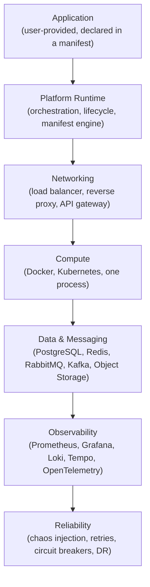
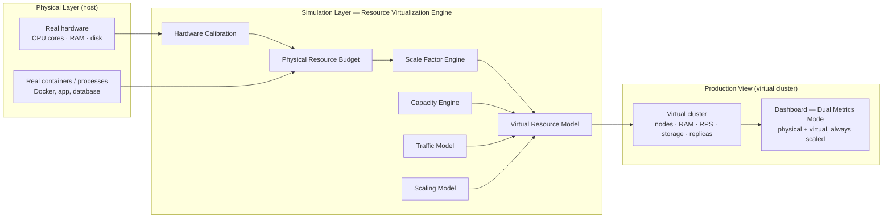

# ForgeLab Architecture

**Document status:** Baseline · v1.0
**Primary decision record:** [`docs/decisions/0001-apply-stack-foundations.md`](decisions/0001-apply-stack-foundations.md)

## One rule: every layer is optional

ForgeLab is **modular composition**, not a fixed architecture. A user declares an application and the components they want; the platform composes them at run time. Any layer can be reduced to "none" without breaking the rest.



The arrows denote *control/dependency flow, not a mandatory chain*. Each layer exists only if the manifest asks for it.

## The layers

### Application

The user's own code. Anything that can run in a container or as a process: a monolith, a server-rendered app, an SPA + API, microservices, event-driven services, background workers. It is described by an **application manifest** (`manifests/application.schema.yaml`) and is never part of the platform itself.

### Platform Runtime

The orchestration heart of ForgeLab:

* Reads and validates application manifests.
* Resolves which components the manifest requests.
* Starts, scales, observes, and stops environments.
* Exposes the control API consumed by the dashboard and CLI.

The simulation core lives here and is **pure Go**, separable from any CLI/API/UI layer. It is deterministic and testable headlessly.

### Networking

Entry traffic and internal topology:

* Load balancer, reverse proxy, API gateway
* Service discovery, DNS, ingress
* TLS termination

This layer routes **to** the compute layer. Like everything else, it is optional — a single-process lab needs nothing here.

### Compute

Where the application actually runs:

* Local processes, Docker containers, or Kubernetes
* Horizontal scaling (HPA), scheduling, resource limits
* Deployment strategies (rolling, canary, blue/green)

ForgeLab must run the same manifest on a laptop or on a cluster.

### Data & Messaging

State and asynchrony:

* Databases (PostgreSQL)
* Caches / in-memory state (Redis)
* Message brokers (RabbitMQ, Kafka)
* Object storage

This layer is also optional — an app that needs no persistence uses none.

### Observability

Everything observable by default:

* Metrics (Prometheus + Grafana)
* Logs (Loki)
* Traces (Tempo / OpenTelemetry)
* One pipeline per component; no special-casing required to be seen.

### Reliability

The layer that makes failure a feature:

* Chaos injection (kill pods, saturate CPU, add latency, drop packets)
* Resiliency patterns (retries, timeouts, circuit breakers, backpressure)
* Disaster recovery and backup/restore drills

## Rules that follow

1. **No implicit dependencies.** If a manifest omits networking, nothing proxies anything.
2. **Composition is explicit.** Every component used is declared by the user.
3. **The dashboards/UI is a consumer.** The Next.js dashboard reads the runtime API; it never reimplements simulation logic.
4. **Documentation precedes implementation.** A layer may not be built before its catalog entry and phase exist.
5. **Physical ≠ Virtual.** Every environment has a physical footprint and a virtual production surface. The simulator scales capacity, never correctness; all virtual metrics carry their scale factor.

## Local single-node envelope (Phase 1)

The first runnable shape is a single-node **Docker Compose** stack for the `local` preset: a reverse proxy, one user application, and one database (PostgreSQL). Details, rationale, and the placement of the Go core in `core/` are recorded in [`docs/decisions/0002-local-single-node-runtime.md`](decisions/0002-local-single-node-runtime.md). Later phases reuse this envelope when composing observability, messaging, and reliability around it.

## Resource Virtualization Engine

ForgeLab runs on a developer's finite local hardware (e.g. 16 GB RAM, 8 CPU cores) yet must simulate production systems that can span hundreds of servers, terabytes of memory, and millions of requests per second. The virtualization engine is the subsystem that reconciles the two: it **never fakes behavior, only virtualizes capacity**.

It distinguishes two kinds of resources:

* **Physical Resources** — the user's actual hardware: real CPU cores, RAM, disk, and running containers/processes.
* **Virtual Production Resources** — the simulated production environment ForgeLab presents: virtual nodes, RAM, storage, RPS, replicas, and database capacity.

### Three-layer model



The layers:

1. **Physical Layer** — the actual host. Hardware detection, remaining free resources, and the real containers/processes ForgeLab orchestrates.
2. **Simulation Layer** — the Resource Virtualization Engine. Calibrates the host, budgets physical resources, computes a deterministic **scale factor** (×64, ×128, …), and maintains the virtual resource model of the declared production topology.
3. **Production View** — the virtual cluster the user interacts with: the nodes, capacities, traffic, and topologies of the simulated production environment, with all metrics presented in virtual terms.

The engine preserves real system dynamics: the same bottleneck, latency, or exhaustion behavior that would occur in real production is reproduced, but the *displayed capacity* is scaled by the active factor.

### Planned module structure (`simulation/`)

The engine is planned as modules under `simulation/` at the repository root, kept as pure Go, deterministic, and headless-testable (see `docs/component-catalog.md` → **Simulation** domain):

```text
simulation/
├── capacity-engine/
├── resource-virtualization/
├── scaling-model/
├── traffic-model/
├── calibration/
└── profiles/
```

### Dashboard: Dual Metrics Mode

The dashboard consumes the runtime API and must render, for every infrastructure view, both:

* **Physical Host Metrics** — real CPU, RAM, disk, containers.
* **Virtual Production Metrics** — virtual nodes, RAM, RPS, storage, replicas.

The UI must always display the current simulation scale (e.g. ×64, ×128) and must **never present virtual values as real hardware measurements**. Virtual values are labelled and visually distinct from host metrics.

## Boundary: platform vs application

```text
PLATFORM (this repo)                          APPLICATION (user-supplied)
─────────────────────────                    ──────────────────────────────
manifests, runtime, components          │    business logic, endpoints, jobs
observability, scenarios, dashboard     │    dependency choices over what the
IaC, environments, templates            │    manifest exposes
```

Code in `applications/` is always a **sample** demonstrating how to plug in; it is never required and never part of the platform.