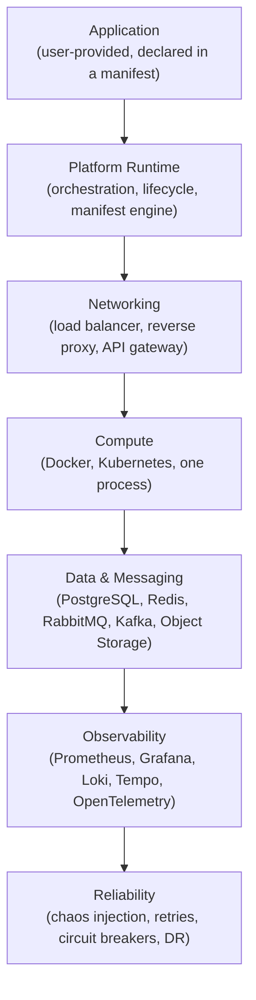

# ForgeLab Architecture

**Document status:** Baseline · v1.0
**Primary decision record:** [`docs/decisions/0001-apply-stack-foundations.md`](decisions/0001-apply-stack-foundations.md)

## One rule: every layer is optional

ForgeLab is **modular composition**, not a fixed architecture. A user declares an application and the components they want; the platform composes them at run time. Any layer can be reduced to "none" without breaking the rest.



The arrows denote *control/dependency flow, not a mandatory chain*. Each layer exists only if the manifest asks for it.

## The layers

### Application

The user's own code. Anything that can run in a container or as a process: a monolith, a server-rendered app, an SPA + API, microservices, event-driven services, background workers. It is described by an **application manifest** (`manifests/application.schema.yaml`) and is never part of the platform itself.

### Platform Runtime

The orchestration heart of ForgeLab:

* Reads and validates application manifests.
* Resolves which components the manifest requests.
* Starts, scales, observes, and stops environments.
* Exposes the control API consumed by the dashboard and CLI.

The simulation core lives here and is **pure Go**, separable from any CLI/API/UI layer. It is deterministic and testable headlessly.

### Networking

Entry traffic and internal topology:

* Load balancer, reverse proxy, API gateway
* Service discovery, DNS, ingress
* TLS termination

This layer routes **to** the compute layer. Like everything else, it is optional — a single-process lab needs nothing here.

### Compute

Where the application actually runs:

* Local processes, Docker containers, or Kubernetes
* Horizontal scaling (HPA), scheduling, resource limits
* Deployment strategies (rolling, canary, blue/green)

ForgeLab must run the same manifest on a laptop or on a cluster.

### Data & Messaging

State and asynchrony:

* Databases (PostgreSQL)
* Caches / in-memory state (Redis)
* Message brokers (RabbitMQ, Kafka)
* Object storage

This layer is also optional — an app that needs no persistence uses none.

### Observability

Everything observable by default:

* Metrics (Prometheus + Grafana)
* Logs (Loki)
* Traces (Tempo / OpenTelemetry)
* One pipeline per component; no special-casing required to be seen.

### Reliability

The layer that makes failure a feature:

* Chaos injection (kill pods, saturate CPU, add latency, drop packets)
* Resiliency patterns (retries, timeouts, circuit breakers, backpressure)
* Disaster recovery and backup/restore drills

## Rules that follow

1. **No implicit dependencies.** If a manifest omits networking, nothing proxies anything.
2. **Composition is explicit.** Every component used is declared by the user.
3. **The dashboards/UI is a consumer.** The Next.js dashboard reads the runtime API; it never reimplements simulation logic.
4. **Documentation precedes implementation.** A layer may not be built before its catalog entry and phase exist.

## Local single-node envelope (Phase 1)

The first runnable shape is a single-node **Docker Compose** stack for the `local` preset: a reverse proxy, one user application, and one database (PostgreSQL). Details, rationale, and the placement of the Go core in `core/` are recorded in [`docs/decisions/0002-local-single-node-runtime.md`](decisions/0002-local-single-node-runtime.md). Later phases reuse this envelope when composing observability, messaging, and reliability around it.

## Boundary: platform vs application

```text
PLATFORM (this repo)                          APPLICATION (user-supplied)
─────────────────────────                    ──────────────────────────────
manifests, runtime, components          │    business logic, endpoints, jobs
observability, scenarios, dashboard     │    dependency choices over what the
IaC, environments, templates            │    manifest exposes
```

Code in `applications/` is always a **sample** demonstrating how to plug in; it is never required and never part of the platform.