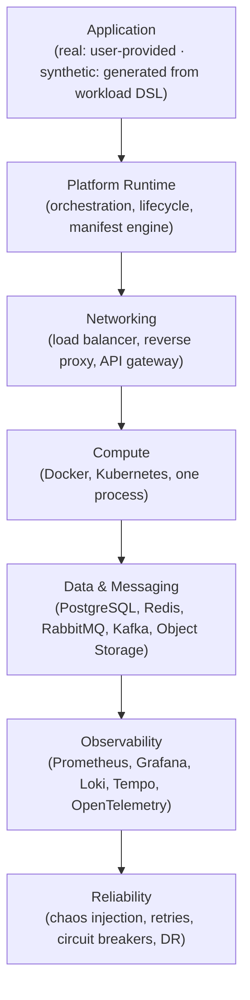
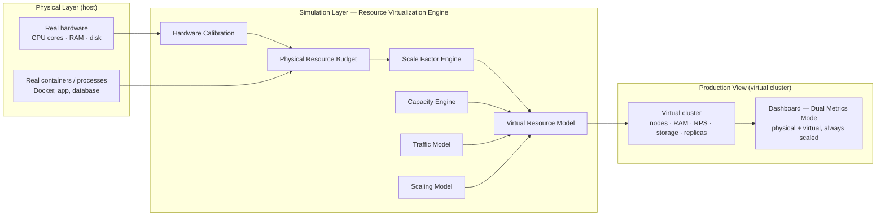

# ForgeLab Architecture

**Document status:** Baseline · v1.0
**Primary decision record:** [`docs/decisions/0001-apply-stack-foundations.md`](decisions/0001-apply-stack-foundations.md)

## One rule: every layer is optional

ForgeLab is **modular composition**, not a fixed architecture. A user declares an application and the components they want; the platform composes them at run time. Any layer can be reduced to "none" without breaking the rest.



The arrows denote *control/dependency flow, not a mandatory chain*. Each layer exists only if the manifest asks for it.

## The layers

### Application

Two distinct modes feed this layer:

* **Real Applications (Mode A)** — the user's own code: a monolith, a server-rendered app, an SPA + API, microservices, event-driven services, background workers. Anything that can run in a container or as a process. Declared by an **application manifest** (`manifests/application.schema.yaml`) and never part of the platform itself.
* **Synthetic Applications (Mode B)** — generated entirely from configuration by the **Workload Engine** (see below). No business logic required; the application models the production operations that create system behavior. Declared with the future **Workload DSL**.

Both modes are optional inputs; an environment can run either, or both.

### Platform Runtime

The orchestration heart of ForgeLab:

* Reads and validates application manifests.
* Resolves which components the manifest requests.
* Starts, scales, observes, and stops environments.
* Exposes the control API consumed by the dashboard and CLI.

The simulation core lives here and is **pure Go**, separable from any CLI/API/UI layer. It is deterministic and testable headlessly.

### Networking

Entry traffic and internal topology:

* Load balancer, reverse proxy, API gateway
* Service discovery, DNS, ingress
* TLS termination

This layer routes **to** the compute layer. Like everything else, it is optional — a single-process lab needs nothing here.

### Compute

Where the application actually runs:

* Local processes, Docker containers, or Kubernetes
* Horizontal scaling (HPA), scheduling, resource limits
* Deployment strategies (rolling, canary, blue/green)

ForgeLab must run the same manifest on a laptop or on a cluster.

### Data & Messaging

State and asynchrony:

* Databases (PostgreSQL)
* Caches / in-memory state (Redis)
* Message brokers (RabbitMQ, Kafka)
* Object storage

This layer is also optional — an app that needs no persistence uses none.

### Observability

Everything observable by default:

* Metrics (Prometheus + Grafana)
* Logs (Loki)
* Traces (Tempo / OpenTelemetry)
* One pipeline per component; no special-casing required to be seen.

### Reliability

The layer that makes failure a feature:

* Chaos injection (kill pods, saturate CPU, add latency, drop packets)
* Resiliency patterns (retries, timeouts, circuit breakers, backpressure)
* Disaster recovery and backup/restore drills

## Rules that follow

1. **No implicit dependencies.** If a manifest omits networking, nothing proxies anything.
2. **Composition is explicit.** Every component used is declared by the user.
3. **The dashboards/UI is a consumer.** The Next.js dashboard reads the runtime API; it never reimplements simulation logic.
4. **Documentation precedes implementation.** A layer may not be built before its catalog entry and phase exist.
5. **Physical ≠ Virtual.** Every environment has a physical footprint and a virtual production surface. The simulator scales capacity, never correctness; all virtual metrics carry their scale factor.
6. **Simulate behavior, not features.** Synthetic applications model the operational workload (requests, DB reads/writes, cache, messaging, latency), not business logic. Feature labels are visualization, never the simulation model.

## Local single-node envelope (Phase 1)

The first runnable shape is a single-node **Docker Compose** stack for the `local` preset: a reverse proxy, one user application, and one database (PostgreSQL). Details, rationale, and the placement of the Go core in `core/` are recorded in [`docs/decisions/0002-local-single-node-runtime.md`](decisions/0002-local-single-node-runtime.md). Later phases reuse this envelope when composing observability, messaging, and reliability around it.

## Resource Virtualization Engine

ForgeLab runs on a developer's finite local hardware (e.g. 16 GB RAM, 8 CPU cores) yet must simulate production systems that can span hundreds of servers, terabytes of memory, and millions of requests per second. The virtualization engine is the subsystem that reconciles the two: it **never fakes behavior, only virtualizes capacity**.

It distinguishes two kinds of resources:

* **Physical Resources** — the user's actual hardware: real CPU cores, RAM, disk, and running containers/processes.
* **Virtual Production Resources** — the simulated production environment ForgeLab presents: virtual nodes, RAM, storage, RPS, replicas, and database capacity.

### Three-layer model



The layers:

1. **Physical Layer** — the actual host. Hardware detection, remaining free resources, and the real containers/processes ForgeLab orchestrates.
2. **Simulation Layer** — the Resource Virtualization Engine. Calibrates the host, budgets physical resources, computes a deterministic **scale factor** (×64, ×128, …), and maintains the virtual resource model of the declared production topology.
3. **Production View** — the virtual cluster the user interacts with: the nodes, capacities, traffic, and topologies of the simulated production environment, with all metrics presented in virtual terms.

The engine preserves real system dynamics: the same bottleneck, latency, or exhaustion behavior that would occur in real production is reproduced, but the *displayed capacity* is scaled by the active factor.

### Planned module structure (`simulation/`)

The engine is planned as modules under `simulation/` at the repository root, kept as pure Go, deterministic, and headless-testable (see `docs/component-catalog.md` → **Simulation** domain):

```text
simulation/
├── capacity-engine/
├── resource-virtualization/
├── scaling-model/
├── traffic-model/
├── calibration/
└── profiles/
```

### Dashboard: Dual Metrics Mode

The dashboard consumes the runtime API and must render, for every infrastructure view, both:

* **Physical Host Metrics** — real CPU, RAM, disk, containers.
* **Virtual Production Metrics** — virtual nodes, RAM, RPS, storage, replicas.

The UI must always display the current simulation scale (e.g. ×64, ×128) and must **never present virtual values as real hardware measurements**. Virtual values are labelled and visually distinct from host metrics.

## Synthetic Applications / Workload Engine

ForgeLab must not require a user to build a real business application before using the platform. The **Workload Engine** lets the platform generate a *production-like application entirely from configuration*. This subsystem is a first-class input alongside real applications; it is planned and documented here, authorized by the roadmap, and not yet implemented.

### Two application modes

| Mode | What the user provides | What ForgeLab does |
|---|---|---|
| **A — Real Applications** | An existing application: Phoenix, Rails, Django, FastAPI, Spring Boot, Node.js, Next.js, or any containerized application | Deploys and observes the real application |
| **B — Synthetic Applications** | A workload definition (future Workload DSL); no business logic needed | Generates an application whose behavior is a model of production operations |

### Simulate behavior, not features

> ForgeLab simulates application behavior, not business features.

A synthetic application models the **production operations** that create system behavior:

* HTTP endpoints, database reads/writes, transactions, cache reads/writes
* CPU and memory workloads, external service calls
* Message publishing/consumption, background/scheduled jobs
* File operations, WebSockets
* Retries, timeouts, concurrency, connection pools, rate limiting
* Authentication-like workloads, batch processing

A "feature" is primarily a human-readable label used for visualization. For example, `"Search Flights"` may internally mean:

```text
HTTP request
    ↓
Redis lookup
    ↓
PostgreSQL reads × 5
    ↓
External service call × 2
    ↓
CPU processing
    ↓
HTTP response
```

The simulator cares about those operations, not the actual flight-search implementation. The same operational workload can be relabeled `"Checkout"`, `"Book Flight"`, `"Transfer Money"`, `"Place Order"`, or `"Create Reservation"` with no change in system behavior. **Business-domain terminology is a visualization layer; operational behavior is the simulation model.**

### Workload DSL (conceptual)

Synthetic applications are declared with a future **Workload DSL** — a declarative configuration model. The exact schema is **not finalized**; it will evolve. The shape below is illustrative:

```yaml
application:
  name: travel-platform

services:

  search:
    replicas: 3

    endpoints:

      - name: search_flights
        method: GET
        path: /search

        operations:
          cache_read: 3
          db_read: 5
          external_call: 2
          cpu: low

        latency:
          base: 120ms

      - name: book_flight
        method: POST
        path: /booking

        operations:
          db_read: 2
          db_write: 4
          transaction: true
          publish_event:
            broker: rabbitmq

  notification:
    worker:
      concurrency: 10

      operations:
        consume:
          broker: rabbitmq
        external_call: 1
        db_write: 1
```

### Synthetic application architecture (conceptual)

```text
                 Synthetic Application Definition
                              │
                              ▼
                       Workload DSL
                              │
                              ▼
                    Workload/Service Engine
                              │
             ┌────────────────┼────────────────┐
             ▼                ▼                ▼
        HTTP Service     Worker Service    Scheduler
             │                │                │
             └────────────────┼────────────────┘
                              │
             ┌────────────────┼────────────────┐
             ▼                ▼                ▼
        PostgreSQL          Redis          Message Broker
             │                │                │
             └────────────────┼────────────────┘
                              ▼
                       Observability
                  Metrics / Logs / Traces
```

A generated application must behave like a production workload from the perspective of: networking, resource consumption, database access, caching, messaging, concurrency, latency, failures, scaling, and observability.

### Workload templates

A future library of reusable workload templates. These are **workload templates, not complete business applications**:

```text
synthetic-apps/
├── templates/
│   ├── generic/
│   │   ├── crud-api
│   │   ├── read-heavy-api
│   │   ├── write-heavy-api
│   │   ├── websocket
│   │   ├── file-upload
│   │   └── background-worker
│   │
│   ├── ecommerce/
│   │   ├── catalog
│   │   ├── cart
│   │   ├── checkout
│   │   └── inventory
│   │
│   ├── travel/
│   │   ├── search
│   │   ├── booking
│   │   └── notification
│   │
│   ├── banking/
│   │   ├── account
│   │   ├── transfer
│   │   └── ledger
│   │
│   └── social/
│       ├── feed
│       ├── chat
│       ├── notification
│       └── media
```

Templates describe the engineering characteristics of a workload (read-heavy, write-heavy, message-heavy, etc.), not a specific product.

### Production-like generated systems

The engine composes generated systems that mirror real production topology, with the user choosing which components are present:

```text
Load Balancer
       ↓
Reverse Proxy
       ↓
API Gateway
       ↓
Multiple Services
       ↓
┌──────────────┬───────────────┬───────────────┐
│ PostgreSQL   │ Redis         │ RabbitMQ/Kafka │
└──────────────┴───────────────┴───────────────┘
       ↓
Workers
       ↓
External Services
```

Component selection is explicit:

```yaml
components:
  load_balancer: true
  reverse_proxy: true
  api_gateway: true
  postgres: true
  redis: true
  rabbitmq: true
  kafka: false
  workers: true
  websocket: false
```

### Relationship to Resource Virtualization

Synthetic applications consume **simulated resources** through the Resource Virtualization Engine: CPU, memory, network, disk, database capacity, connection pools, cache capacity, queue capacity, worker concurrency.

Together the two subsystems model a production-scale application without requiring matching physical infrastructure:

```text
Physical Machine
    8 CPU · 16 GB RAM · 1,000 actual RPS
        ↓
Resource Virtualization
    ×1,000 workload scale
        ↓
Simulated Production
    8,000 virtual CPU · 16 TB virtual RAM · 1,000,000 logical RPS
```

This is a **capacity/workload model**, not an attempt to execute one million real requests on the local machine. The physical layer still runs what the host can actually run; the virtual layer presents the simulated production surface.

### Relationship to scenarios

Synthetic applications are designed to work with the scenario engine — they are the substrate on which scenarios run:

```text
Generate traffic
       ↓
Synthetic application
       ↓
Database becomes saturated
       ↓
Latency increases
       ↓
Queue backlog grows
       ↓
Workers scale
       ↓
Database remains bottleneck
       ↓
Incident
```

Planned scenario targets (see `docs/scenarios.md`): cache failure, database slowdown, database lock contention, connection pool exhaustion, Redis eviction, RabbitMQ backlog, Kafka consumer lag, CPU saturation, memory pressure, external API latency/failure, retry storm, timeout cascade, traffic spike/distribution change, pod/service failure, network latency, packet loss, deployment regression.

### Planned generator structure (`synthetic-apps/`)

The generator is planned under `synthetic-apps/`. The implementation language and architecture remain **open at this stage**:

```text
synthetic-apps/
├── workload-engine/
├── application-generator/
├── service-generator/
├── endpoint-generator/
├── operation-engine/
├── db-model/
├── cache-model/
├── messaging-model/
├── concurrency-model/
├── telemetry-generator/
└── templates/
```

### Dashboard integration

The dashboard will eventually support creating a synthetic application visually:

```text
Create Simulation
        │
        ▼
Application Type
   ├── Real Application
   └── Synthetic Application
             │
             ▼
       Select Templates
             │
             ▼
       Configure Services
             │
             ▼
      Configure Operations
             │
             ▼
       Configure Traffic
             │
             ▼
      Configure Infrastructure
             │
             ▼
       Start Simulation
```

Dashboard users will be able to: create services, add endpoints, select workload templates, configure DB/cache/message-broker operations, configure worker concurrency, configure latency, failure and traffic-distribution parameters, and configure scaling policies.

## Boundary: platform vs application

```text
PLATFORM (this repo)                          APPLICATION (user-supplied)
─────────────────────────                    ──────────────────────────────
manifests, runtime, components          │    business logic, endpoints, jobs
observability, scenarios, dashboard     │    dependency choices over what the
IaC, environments, templates            │    manifest exposes
```

Code in `applications/` is always a **sample** demonstrating how to plug in; it is never required and never part of the platform.