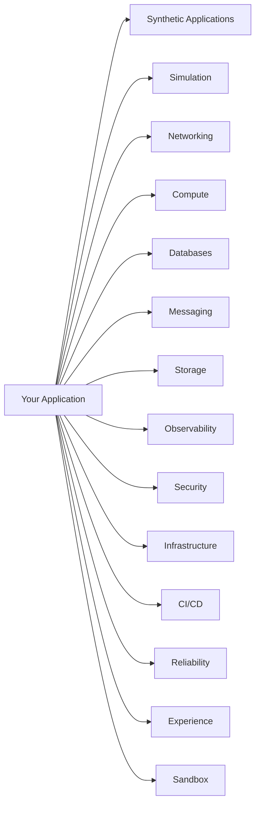

# ForgeLab Component Catalog

**Document status:** Baseline · v1.0

Every component ForgeLab plans to offer, grouped by domain. **Nearly everything is still cataloged as *planned***; items ship only when a roadmap phase authorizes them and are always optional: a user may opt out of anything. Implementation status of each row is tracked inline.

Reference for naming and structure: `AGENTS.md` §9. A component becomes real when it lands in `components/<domain>/<component>/`.

## Domain overview

## Catalog by domain

### Synthetic Applications

| Component | Provides | Depends on | Status |
|---|---|---|---|
| Workload Engine | Interprets the Workload DSL and drives the synthetic application lifecycle | Service Generator, Operation Engine | planned |
| Application Generator | Composes a synthetic application from a workload definition / selected templates | Workload Engine, Service Generator | planned |
| Service Generator | Emits service definitions (HTTP, worker, scheduler) from the application model | Endpoint Generator | planned |
| Endpoint Generator | Emits endpoints with their operation chains and latency profiles | Operation Engine | planned |
| Operation Engine | Executes production operations: HTTP, db reads/writes, cache, messaging, cpu, memory, file, latency, retries | Data Models, Concurrency Model | planned |
| Data Models | Operation profiles for PostgreSQL, Redis, RabbitMQ/Kafka, storage | Resource Virtualization Engine | planned |
| Concurrency Model | Worker concurrency, connection pools, rate limiting | Resource Virtualization Engine | planned |
| Telemetry Generator | Emits metrics/logs/traces for synthetic workloads | Observability | planned |
| Workload Templates | Reusable workload profiles (crud-api, read-heavy-api, checkout, search, …) declared in the Workload DSL | Workload DSL | planned |

### Simulation

| Component | Provides | Depends on | Status |
|---|---|---|---|
| Hardware Calibration | Host detection, CPU/RAM/disk measurement, physical resource budgeting (`core/internal/calibration`, `core/internal/budget`, `forgelab host`) | — | implemented |
| Resource Virtualization Engine | Physical ↔ virtual resource translation; scale factor application across the whole production view (`core/internal/virtualcluster`, `core/internal/scale`, `core/internal/metrics`, `forgelab cluster`) | Hardware Calibration, Resource Profiles | implemented |
| Capacity Engine | Virtual capacity modeling: CPU, RAM, storage, and database capacity (`core/internal/capacity`) | Resource Virtualization Engine | implemented |
| Scaling Model | Horizontal and vertical scaling virtualization; capacity exhaustion simulation | Resource Virtualization Engine | planned |
| Traffic Model | Virtual RPS / request scaling and load shaping; physical ↔ virtual traffic translation | Scaling Model | planned |
| Resource Profiles | Named virtual hardware profiles (node sizes, storage tiers) for composing virtual clusters (built-in `small`/`medium`/`large`/`xlarge` in `core/internal/virtualcluster`) | Hardware Calibration | implemented |

### Networking

| Component | Provides | Depends on | Status |
|---|---|---|---|
| Load Balancer | Distributes traffic across replicas; health-based routing | Compute | implemented · Phase 4 (`components/networking/load-balancer/`) |
| Reverse Proxy | TLS termination, routing, buffering, WAF surface | Compute | implemented · Phase 1 (`components/networking/reverse-proxy/`) |
| API Gateway | Authn/authz, rate limiting, request shaping, aggregation | Reverse Proxy, Compute | planned |
| Service Discovery | Registers/services resolve peers automatically | Compute | planned |

### Compute

| Component | Provides | Depends on | Status |
|---|---|---|---|
| Docker | Container runtime, images, networks, volumes | — | planned |
| Kubernetes | Orchestration, scheduling, scaling, rollouts, self-healing | Docker | implemented · Phase 4 (`components/compute/kubernetes/`) |
| Runtime Manager | Local process runner for non-containerized labs | — | planned |
| Autoscaler (HPA) | Horizontal scaling on load/metrics | Kubernetes | implemented · Phase 4 (`components/compute/autoscaler-hpa/`) |

### Databases

| Component | Provides | Depends on | Status |
|---|---|---|---|
| PostgreSQL | Relational storage, transactions, replication | Compute | implemented · Phase 1 (`components/databases/postgresql/`) |
| Redis | Cache, in-memory store, pub/sub, rate limiting | Compute | implemented · Phase 3 (`components/databases/redis/`) |

### Messaging

| Component | Provides | Depends on | Status |
|---|---|---|---|
| RabbitMQ | AMQP queues, exchanges, work distribution, DLQs | Compute | implemented · Phase 3 (`components/messaging/rabbitmq/`) |
| Kafka | Append-only streams, consumer groups, replay, partitioning | Compute | implemented · Phase 3 (`components/messaging/kafka/`) |
| DLQ Handler | Dead-letter queue UI, retry/requeue, analysis | RabbitMQ / Kafka | implemented · Phase 3 (`components/messaging/dlq-handler/`) |

### Storage

| Component | Provides | Depends on | Status |
|---|---|---|---|
| Object Storage | Buckets/objects for artifacts, media, backups | Compute | planned |

### Observability

| Component | Provides | Depends on | Status |
|---|---|---|---|
| OpenTelemetry | Instrumentation protocol, collectors, exporters | All components | implemented · Phase 2 (`components/observability/opentelemetry/`) |
| Prometheus | Metrics collection, scrapes, alert rules | Compute | implemented · Phase 2 (`components/observability/prometheus/`) |
| Grafana | Dashboards, alerting UI, visualization | Prometheus, Loki, Tempo | implemented · Phase 2 (`components/observability/grafana/`) |
| Loki | Log aggregation and search | Compute | implemented · Phase 2 (`components/observability/loki/`) |
| Tempo | Distributed traces store and query | OpenTelemetry | implemented · Phase 2 (`components/observability/tempo/`) |

### Security

| Component | Provides | Depends on | Status |
|---|---|---|---|
| Secrets Management | Store/rotate credentials without leaking them | Compute | implemented · Phase 8 (`components/security/secrets-management/`) |
| TLS / PKI | Certificates for all internal and external traffic | Reverse Proxy | implemented · Phase 8 (`components/security/tls-pki/`) |
| Network Policy | East-west traffic segmentation, RBAC enforcement | Kubernetes | implemented · Phase 8 (`components/security/network-policy/`) |
| Scanner | Vulnerability/image/compliance scanning | Compute | implemented · Phase 8 (`components/security/scanner/`; secret and compliance scanning, no image/CVE scanning) |

### Infrastructure

| Component | Provides | Depends on | Status |
|---|---|---|---|
| Terraform | Infrastructure-as-Code on cloud presets | Cloud providers | implemented · Phase 6 (`components/infrastructure/terraform/`) |
| AWS Preset | Managed-service variants of components (EKS, RDS, SQS, etc.) | Terraform | implemented · Phase 6 (`components/infrastructure/aws-preset/`) |
| GCP Preset | Managed-service variants of components (GKE, CloudSQL, Pub/Sub, etc.) | Terraform | implemented · Phase 6 (`components/infrastructure/gcp-preset/`) |
| Config Sync | Versioned drift detection and reconciliation | Terraform / Kubernetes | planned |

### CI/CD

| Component | Provides | Depends on | Status |
|---|---|---|---|
| Pipeline Runner | Simulated build → test → deploy pipelines | Compute | implemented · Phase 7 (`components/cicd/pipeline-runner/`) |
| Deploy Controller | Rolling, canary, blue/green rollout strategies | Kubernetes / Docker | implemented · Phase 4 (`components/cicd/deploy-controller/`) |
| Artifact Registry | Versioned build artifacts | Object Storage | planned |

### Experience

| Component | Provides | Depends on | Status |
|---|---|---|---|
| Benchmark Reporter | Baseline/ramp/spike benchmarks with SLO verdicts; Markdown and JSON reports | Load Generator, Resource Virtualization Engine | implemented · Phase 9 (`components/experience/benchmark-reporter/`) |
| Learning Tracker | Learning path as data, progress tracking, automatic completion from evidence | Chaos Engine, Benchmark Reporter | implemented · Phase 9 (`components/experience/learning-tracker/`) |
| End-to-End Runner | One-command run of the Compose lab: smoke tests, drills, benchmark | Docker | implemented · Phase 9 (`components/experience/e2e-runner/`) |

### Sandbox

Model-driven production-system game (Sandbox mode, ADR-0013). These are platform components of the game itself; the components a player places in a game (load balancer, application instance, database, …) are entries in the Sandbox ruleset, not repository components.

| Component | Provides | Depends on | Status |
|---|---|---|---|
| Sandbox Engine | Deterministic world state, command log, tick loop, save/replay (`core/internal/sandbox`) | — | implemented · Phase 10 (`components/sandbox/sandbox-engine/`) |
| Sandbox Ruleset | Versioned data: placeable component kinds, capacities, costs, complexity weights, tuning (`sandbox/v1`) | Sandbox Engine | implemented · Phase 10 (`components/sandbox/sandbox-engine/`) |
| Flow Solver | Routes per-tick load through the player's topology; utilization, latency, saturation, errors | Sandbox Engine, Sandbox Ruleset | implemented · Phase 10 (`components/sandbox/sandbox-engine/`) |
| Economy & Meters | Revenue, cost, cash; health, satisfaction, popularity, engagement, complexity, scale, userbase | Flow Solver | implemented · Phase 10 (`components/sandbox/sandbox-engine/`) |
| Event Deck | Seeded, state-dependent events and incidents (surges, outages, DDoS, cost spikes) | Sandbox Engine | planned · Phase 10 |
| Sandbox API | `/api/v1/sandbox/` games, commands, SSE tick stream | Sandbox Engine | planned · Phase 10 |
| Sandbox Canvas | Dashboard screen: build palette, React Flow topology canvas, HUD, inspector, event feed, speed controls | Sandbox API | planned · Phase 10 |

### Reliability

| Component | Provides | Depends on | Status |
|---|---|---|---|
| Chaos Engine | Fault injection: pod kill, latency, packet loss, CPU/mem stress | Runtime environment | implemented · Phase 5 (`components/reliability/chaos-engine/`) |
| Load Generator | Repeatable traffic profiles and benchmarks | Networking | implemented · Phase 5 (`components/reliability/load-generator/`) |
| Resiliency Toolkit | Retries, timeouts, circuit breakers, backpressure patterns | Application layer | planned |
| Backup / Restore | Scheduled snapshots and DR restore drills | Databases, Storage | implemented · Phase 5 (`components/reliability/backup-restore/`) |

---

## Status legend

| Status | Meaning |
|---|---|
| `planned` | Documented in this catalog; not yet authorized by a roadmap phase or implemented |
| `implemented` | Implemented under `components/<domain>/<component>/` and usable |

## Adding a component

Follow `AGENTS.md` §9: check this catalog first, confirm phase authorization, create the component README, update this table, and add an ADR if architectural. A user must always be able to opt out.