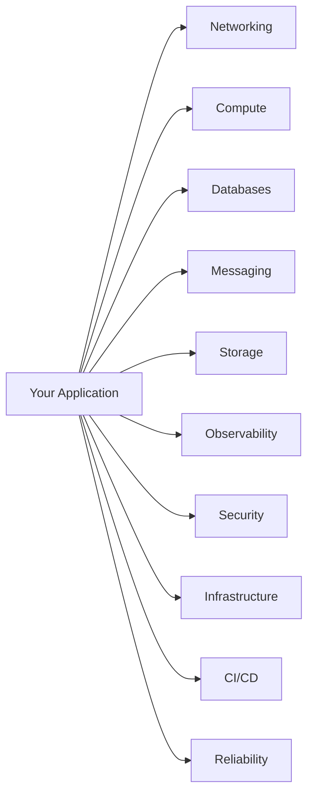

# ForgeLab Component Catalog

**Document status:** Baseline · v1.0

Every component ForgeLab plans to offer, grouped by domain. **Nothing here is implemented yet** — every row is cataloged as *planned*. Components are added only when a roadmap phase authorizes them and are always optional: a user may opt out of anything.

Reference for naming and structure: `AGENTS.md` §9. A component becomes real when it lands in `components/<domain>/<component>/`.

## Domain overview

## Catalog by domain

### Networking

| Component | Provides | Depends on | Status |
|---|---|---|---|
| Load Balancer | Distributes traffic across replicas; health-based routing | Compute | planned |
| Reverse Proxy | TLS termination, routing, buffering, WAF surface | Compute | planned |
| API Gateway | Authn/authz, rate limiting, request shaping, aggregation | Reverse Proxy, Compute | planned |
| Service Discovery | Registers/services resolve peers automatically | Compute | planned |

### Compute

| Component | Provides | Depends on | Status |
|---|---|---|---|
| Docker | Container runtime, images, networks, volumes | — | planned |
| Kubernetes | Orchestration, scheduling, scaling, rollouts, self-healing | Docker | planned |
| Runtime Manager | Local process runner for non-containerized labs | — | planned |
| Autoscaler (HPA) | Horizontal scaling on load/metrics | Kubernetes | planned |

### Databases

| Component | Provides | Depends on | Status |
|---|---|---|---|
| PostgreSQL | Relational storage, transactions, replication | Compute | planned |
| Redis | Cache, in-memory store, pub/sub, rate limiting | Compute | planned |

### Messaging

| Component | Provides | Depends on | Status |
|---|---|---|---|
| RabbitMQ | AMQP queues, exchanges, work distribution, DLQs | Compute | planned |
| Kafka | Append-only streams, consumer groups, replay, partitioning | Compute | planned |
| DLQ Handler | Dead-letter queue UI, retry/requeue, analysis | RabbitMQ / Kafka | planned |

### Storage

| Component | Provides | Depends on | Status |
|---|---|---|---|
| Object Storage | Buckets/objects for artifacts, media, backups | Compute | planned |

### Observability

| Component | Provides | Depends on | Status |
|---|---|---|---|
| OpenTelemetry | Instrumentation protocol, collectors, exporters | All components | planned |
| Prometheus | Metrics collection, scrapes, alert rules | Compute | planned |
| Grafana | Dashboards, alerting UI, visualization | Prometheus, Loki, Tempo | planned |
| Loki | Log aggregation and search | Compute | planned |
| Tempo | Distributed traces store and query | OpenTelemetry | planned |

### Security

| Component | Provides | Depends on | Status |
|---|---|---|---|
| Secrets Management | Store/rotate credentials without leaking them | Compute | planned |
| TLS / PKI | Certificates for all internal and external traffic | Reverse Proxy | planned |
| Network Policy | East-west traffic segmentation, RBAC enforcement | Kubernetes | planned |
| Scanner | Vulnerability/image/compliance scanning | Compute | planned |

### Infrastructure

| Component | Provides | Depends on | Status |
|---|---|---|---|
| Terraform | Infrastructure-as-Code on cloud presets | Cloud providers | planned |
| AWS Preset | Managed-service variants of components (EKS, RDS, SQS, etc.) | Terraform | planned |
| GCP Preset | Managed-service variants of components (GKE, CloudSQL, Pub/Sub, etc.) | Terraform | planned |
| Config Sync | Versioned drift detection and reconciliation | Terraform / Kubernetes | planned |

### CI/CD

| Component | Provides | Depends on | Status |
|---|---|---|---|
| Pipeline Runner | Simulated build → test → deploy pipelines | Compute | planned |
| Deploy Controller | Rolling, canary, blue/green rollout strategies | Kubernetes / Docker | planned |
| Artifact Registry | Versioned build artifacts | Object Storage | planned |

### Reliability

| Component | Provides | Depends on | Status |
|---|---|---|---|
| Chaos Engine | Fault injection: pod kill, latency, packet loss, CPU/mem stress | Runtime environment | planned |
| Load Generator | Repeatable traffic profiles and benchmarks | Networking | planned |
| Resiliency Toolkit | Retries, timeouts, circuit breakers, backpressure patterns | Application layer | planned |
| Backup / Restore | Scheduled snapshots and DR restore drills | Databases, Storage | planned |

---

## Status legend

| Status | Meaning |
|---|---|
| `planned` | Documented in this catalog; not yet authorized by a roadmap phase or implemented |
| `implemented` | Implemented under `components/<domain>/<component>/` and usable |

## Adding a component

Follow `AGENTS.md` §9: check this catalog first, confirm phase authorization, create the component README, update this table, and add an ADR if architectural. A user must always be able to opt out.