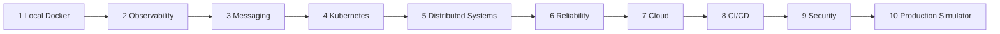

# ForgeLab Learning Path

**Document status:** Baseline · v1.0

A progressive roadmap for the learner, aligned with ForgeLab phases. Each stage is a milestone with a goal, the skills it builds, and the ForgeLab components involved. Stages build on each other; skip nothing.

## Stage 1 — Local Docker

- **Goal:** Run your first container and compose a small stack.
- **Skills:** Images, containers, networks, volumes, `docker compose`, health checks.
- **Components:** Docker, Runtime Manager, `local` environment.
- **Exit:** A two-service stack (app + database) starts with one command and survives restarts.

## Stage 2 — Observability

- **Goal:** See everything running.
- **Skills:** Metrics, structured logs, traces; dashboards; alerting basics.
- **Components:** Prometheus, Grafana, Loki, Tempo, OpenTelemetry.
- **Exit:** Every service in the stack emits metrics/logs/traces visible on one dashboard.

## Stage 3 — Messaging

- **Goal:** Make work async.
- **Skills:** Queues, brokers, consumer groups, DLQs, idempotency, backpressure.
- **Components:** Redis, RabbitMQ, Kafka, DLQ Handler.
- **Exit:** A producer/consumer pipeline with retries and dead-letter handling traced end to end.

## Stage 4 — Kubernetes

- **Goal:** Orchestrate instead of babysit.
- **Skills:** Pods, deployments, services, ingress, HPA, rollouts, namespaces.
- **Components:** Kubernetes, Load Balancer, Deploy Controller, Autoscaler.
- **Exit:** The Stage-1 app runs on Kubernetes with autoscaling and a rolling deploy.

## Stage 5 — Distributed Systems

- **Goal:** Reason about life beyond one process.
- **Skills:** Consistency, partitioning, failure semantics, sagas, CQRS, idempotency.
- **Components:** Full platform; scenarios: db-slowness, partition, latency.
- **Exit:** You can explain what happens when any two components stop agreeing.

## Stage 6 — Reliability

- **Goal:** Make failure routine and boring.
- **Skills:** Chaos injection, retries/circuit breakers, timeout budgets, runbooks, DR.
- **Components:** Chaos Engine, Resiliency Toolkit, Backup/Restore.
- **Exit:** You run and resolve the outage scenarios end to end (`docs/scenarios.md`).

## Stage 7 — Cloud

- **Goal:** Same lab, managed services.
- **Skills:** IaC (Terraform), AWS/GCP primitives, cost awareness, managed vs self-hosted.
- **Components:** Terraform, AWS Preset, GCP Preset, Config Sync.
- **Exit:** The same manifest runs locally and on one cloud provider without logic changes.

## Stage 8 — CI/CD

- **Goal:** Ship like a platform team.
- **Skills:** Pipelines, artifacts, environment promotion, deployment strategies, rollbacks.
- **Components:** Pipeline Runner, Deploy Controller, Artifact Registry.
- **Exit:** A change traverses build → test → canary → prod with an automatic rollback path.

## Stage 9 — Security

- **Goal:** Defend and detect.
- **Skills:** TLS, secrets, RBAC, network policy, scanning, attack detection, containment.
- **Components:** Secrets, TLS/PKI, Network Policy, Scanner, security scenarios.
- **Exit:** You run an attack simulation, detect it via signals, and contain it.

## Stage 10 — Production Simulator

- **Goal:** Synthesize everything into one exercise.
- **Skills:** Incident command, diagnosis under pressure, postmortems, continuous improvement.
- **Components:** Full platform + dashboard + benchmark reporting.
- **Exit:** Run a combined multi-failure scenario, produce a reviewable postmortem, and repeat from Stage 1 with confidence.

---

## Using this path

* Each stage references concrete components in `docs/component-catalog.md` and scenarios in `docs/scenarios.md`.
* Stages map roughly to roadmap phases (`ROADMAP.md`) — the stage is a learning goal, the phase is the authorization to build it.